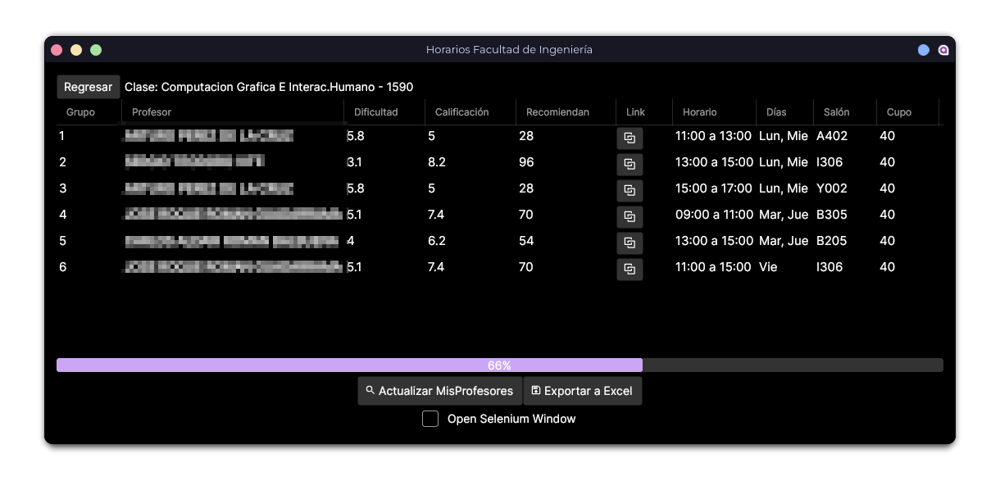

# Horarios FI y MisProfesores

Este programa filtra y busca a los profesores de la Facultad de Ingeniería en la
página de MisProfesores con el objetivo de determinar que tan buenos son,
cuantos lo recomiendan, y el nivel aproximado de dificultad, además de la
información ya otorgada en la página de la facultad.

Basado en una [versión anterior](https://github.com/Azrielx86/FI_Horarios) escrita en Python. Esta nueva versión
escrita en C# utiliza HtmlAgilityPack y Selenium para el web scapping, Avalonia para la interfaz gráfica, 
así como ClosedXML para generar el archivo de Excel.

>[!WARNING]
>MisProfesores no es una fuente _tan_ confiale en realidad, pero puede darte una
>idea básica del profesor. Recomiendo enormemente consultar en los grupos de la facultad
>por referencias.

## Ejemplo de la tabla

El programa exporta la tabla en un archivo xlsx.

En Excel/Google Docs la calificación, dificultad y recomendación se colorean en
verde, amarillo o rojo, dependiendo del rango obtenido

| Clave | Grupo | Nombre     | Calificación | Dificultad | Recomendado | Tipo | Horarios      | Dias     | Cupo | Link   |
| :---- | :---- | :--------- | :----------- | :--------- | :---------- | :--- | :------------ | :------- | :--- | :----- |
| 840   | 1     | Profesor 1 | 7.6          | 2.5        | 70          | T    | 09:00 a 11:00 | Lun, Mie | 40   | Link 1 |
| 840   | 2     | Profesor 2 | 8.5          | 4.8        | 85          | T    | 13:00 a 15:00 | Lun, Mie | 40   | Link 2 |
| 840   | 3     | Profesor 3 | 6.1          | 1.2        | 60          | T    | 19:00 a 21:00 | Lun, Mie | 40   | Link 3 |
| 840   | 4     | Profesor 4 | 7.4          | 4.5        | 74          | T    | 09:00 a 11:00 | Mar, Jue | 40   | Link 4 |
| 840   | 5     | Profesor 5 | 7            | 4.1        | 58          | T    | 11:00 a 13:00 | Mar, Jue | 40   | Link 5 |
| 840   | 6     | Profesor 1 | 8.6          | 3.1        | 100         | T    | 17:30 a 19:30 | Mar, Jue | 40   | Link 6 |

## Interfaz Gráfica

## Mejoras a futuro

- Planeador de horarios (Similar al 
  de , pero sin la generación automática.
- Servidor proxy para acelerar el scraping en MisProfesores.
- Selección del navegador, actualmente requiere Google Chrome (Otras opciones considera Edge, Firefox y Chromium).
  o directamente usar una alternativa a Selenium.

>[!NOTE]
>No me hago responsable del uso que se le de a este programa.
